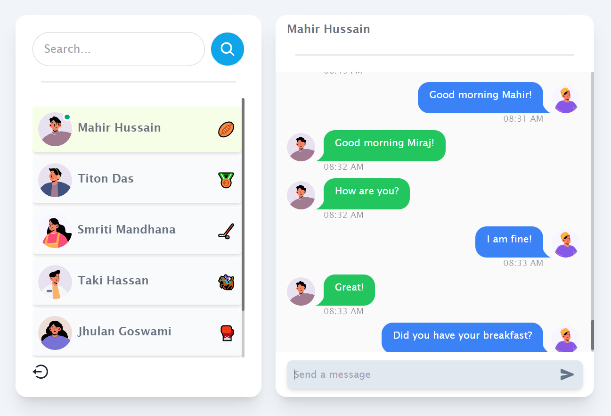

# ChatNow - MERN Stack Real-time Chatting Application with Socket.io

ChatNow is a full-stack real-time chatting application developed using the MERN (MongoDB, Express.js, React.js, Node.js) stack with Socket.io for seamless communication. The application provides a clean and responsive user interface, along with various features to enhance the chatting experience.

## Features

1. **Authentication & Authorization with JWT:** Secure user authentication and authorization using JSON Web Tokens (JWT).
2. **Real-time Messaging with Socket.io:** Instant messaging capabilities for real-time communication.
3. **Online Status of Users:** Track the online status of users using Socket.io and React Context.
4. **Notifications on Receiving Messages:** Receive notifications for new messages.
5. **Simple, Clean, and Responsive UI:** User-friendly interface designed for simplicity and responsiveness.
6. **Real-time Timestamps:** Display real-time timestamps on sent or received messages.
7. **Searching:** Search for users within the application.
8. **And Much More...:** Explore additional functionalities and features!

## Technology Used

- **MongoDB**: Database for storing user data and messages.
- **Express.js**: Server-side framework for handling HTTP requests and responses.
- **React.js**: Frontend library for building the user interface.
- **Node.js**: JavaScript runtime for server-side development.
- **Zustand**: State management library for handling global state.
- **Socket.io**: Real-time bidirectional event-based communication.
- **Tailwind CSS and DaisyUI**: Styling libraries for a clean and visually appealing UI.
- **React Hot Toast**: Notification library for displaying alerts.

## Live Preview

Explore ChatNow in action: [Live Preview](https://chatnow-tsej.onrender.com/)

